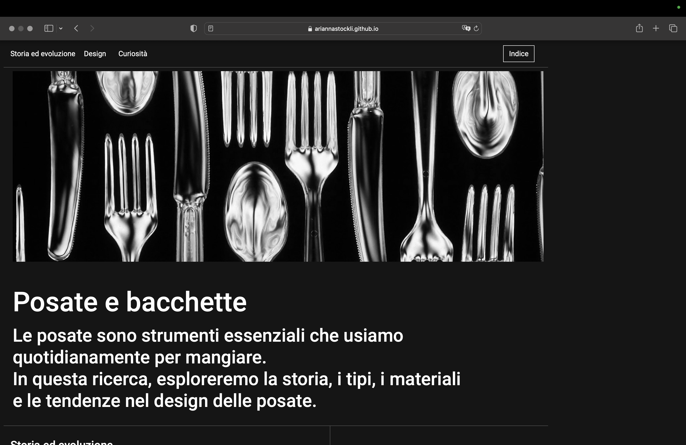

SUPSI 2022-23  
Corso d’interaction design, CV427.01  
Docenti: A. Gysin, G. Profeta  

Elaborato 2: Antologia a due mani 

# Posate e bacchette
Autore: Arianna Stöckli<br>
[Link progetto](https://ariannastockli.github.io/Posate_e_bacchette/)


## Introduzione e tema
Il progetto consisteva nel fare una ricerca testuale e iconografica di oggetti, segni e gesti legati all’uso delle mani. 
Le posate sono strumenti fondamentali per l'alimentazione quotidiana nel mondo occidentale. Questo sito esplora la storia, l'evoluzione, il design e l'utilizzo delle posate e bacchette. Saranno esaminati gli aspetti culturali e curiosi legati alle posate, insieme ai materiali usati, alle forme e alle tendenze attuali nel design delle posate.


## Riferimenti progettuali
Ho preso come riferimenti principali gli articoli citati nelle fonti presenti nel footer del sito. Per quanto riguarda il layout non ho riferimenti specifici.


## Design dell’interfraccia e modalià di interazione
Il design del sito è piuttosto semplice e si sviluppa interamente su una pagina. Attraverso la navbar posizionata in cima è possibile raggiungere facilmente tutti i capitoli della ricerca. Grazie al pulsante “indice” è possibile raggiungere la pagina principale con tutti i progetti.

Il layout è suddiviso in due colonne principali. La colonna a sinistra che contiene il contenuto dettagliato della ricerca sulle posate e a destra le immagini correlate. 
Quando la visualizzazione viene ridimensionata su dispositivi mobili o schermi più piccoli, la colonna si trasforma in un layout singolo, con il testo posizionato sopra e le immagini disposte sotto.

[]()
[]()


## Tecnologia usata
Ho utilizzato HTML e CSS come linguaggi di programmazione principali.


Struttura HTML
```HTML
<!doctype html>
<html>
<head>
    <title>Antologia a due mani</title>
    <meta charset="UTF-8">
    <meta name="viewport" content="initial-scale=1.0">
    <link rel="stylesheet" href="css/style.css">
</head>
<body>
    <header>
        <nav class="container">
            <!-- Elementi di navigazione -->
        </nav>
    </header>
    <main class="main-section">
        <!-- Sezione di introduzione -->
        <article class="colSx">
            <section>
                <h1 id="sezione1">Storia ed evoluzione</h1>
                <!-- Contenuto sulla storia ed evoluzione delle posate -->
            </section>
            <section>
                <h1 id="sezione2">Design</h1>
                <!-- Contenuto sul design delle posate -->
            </section>
            <section>
                <h1 id="sezione3">Curiosità</h1>
                <!-- Contenuto sulle curiosità legate alle posate -->
            </section>
        </article>
    </main>
    <aside class="image-container">
        <!-- Immagini -->
    </aside>
</body>
</html>
```

## Target e contesto d’uso
Il sito potrebbe essere visitato da persone interessate ad approfondire il tema delle posate e bacchette. Chiunque sia interessato al design, alla cucina o semplicemente sia curioso di scoprire di più su questi oggetti. Il sito può rappresentare una risorsa di studio per approfondire la storia, l'evoluzione e l'importanza culturale delle posate e delle bacchette.
